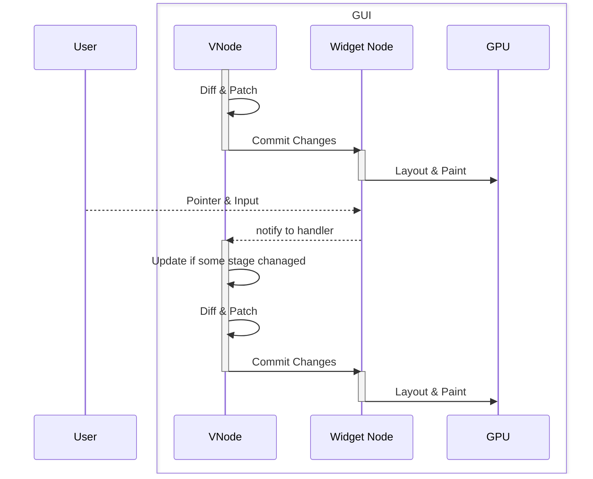

## Gio Compose

[Gio UI](https://gioui.org)
Component solution inspired by [Jetpack Compose](https://developer.android.com/jetpack/compose)
and [React Hooks](https://react.dev/reference/react)

### Why?

Gio UI is cool cross-platform GUI in Golang.
However, with some Component solution, as ui developer used to be with, we could do more things.

### Workflow



### Example

#### Components

```golang
package main

import (
	"fmt"

	"github.com/octohelm/gio-compose/pkg/compose/gesture"
	"github.com/octohelm/gio-compose/pkg/compose/modifier"
	"golang.org/x/image/colornames"

	. "github.com/octohelm/gio-compose/pkg/compose"
)


type Counter struct {
}

func (Counter) Build(b BuildContext) VNode {
	state := UseState(b, 0)

	//showTooltip := UseState(b, false)

	v :=
		Row(
			modifier.FillMaxHeight(),
			modifier.FillMaxSize(),
			modifier.PaddingAll(20),
			modifier.Align(alignment.Center),
		).Children(
			H(CounterButton{
				OnTap: func() {
					state.UpdateFunc(func(prev int) int {
						return prev + 1
					})
				},
			}).Children(
				Text(fmt.Sprint(state.Value()), modifier.TextAlign(text.Middle)),
			),
		)
	return v
}

type CounterButton struct {
	OnTap func()
}

func (b CounterButton) Build(c BuildContext) VNode {
	return Row(
		modifier.DetectGesture(
			gesture.OnTap(b.OnTap),
		),
		modifier.Height(80),
		modifier.FillMaxWidth(),
		modifier.RoundedAll(10),
		modifier.BackgroundColor(color.White),
		modifier.Shadow(2),
		modifier.Align(alignment.Center),
	).Children(
		c.ChildVNodes()...,
	)
}
```

#### App Main

```golang
package main

import (
	"context"
	"os"
	"log"

	"gioui.org/unit"
	"gioui.org/app"

	. "github.com/octohelm/gio-compose/pkg/compose"
	"github.com/octohelm/gio-compose/pkg/compose/renderer"
)

func main() {
	w := app.NewWindow(
		app.MinSize(unit.Dp(1280), unit.Dp(768)),
	)

	r := renderer.CreateRoot(w)

	// could inject singletons in to context
	ctx := context.Background()

	r.Render(ctx, H(Counter{}))

	go func() {
		if err := r.Loop(); err != nil {
			log.Fatal(err)
		}
		os.Exit(0)
	}()

	app.Main()
}

```

See more https://github.com/octohelm/gio-compose/tree/main/cmd/example